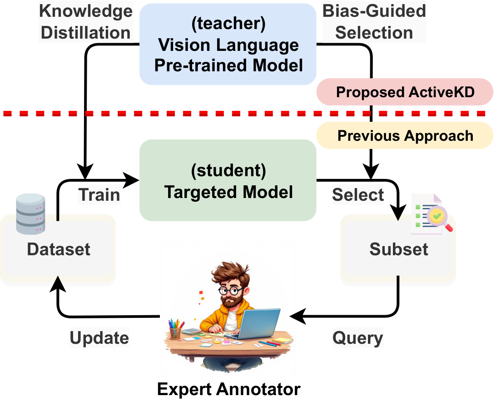
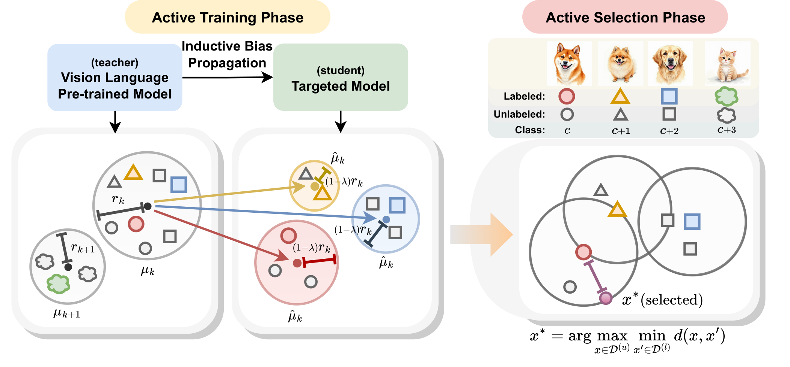

[](https://arxiv.org/abs/2506.00910)

# PCoreSet: Effective Active Learning through Knowledge Distillation from Vision-Language Models

<div style="float: right; margin: 0 0 1em 1em;">
  
</div>

[Seongjae Kang](#), [Dong Bok Lee](#), [Hyungjoon Jang](#), [Dong Sup Kim](#), [Sung Ju Hwang](#)

[[Project Page](#)] [[Paper](https://arxiv.org/abs/2506.00910)]

- ✨ Introduces an **ActiveKD (PCoreSet)** framework for Active Learning under Knowledge Distillation
- 🎯 Enables efficient knowledge transfer from Vision-Language Models to smaller student models
- 🔄 Combines active learning strategies with knowledge distillation for optimal sample selection

## 🔥 News

* **[2024.06.03]** 📦 Code released!
* **[2024.06.01]** 📄 ActiveKD paper is released.

## 🛠️ Code

<div align="center">
  
</div>

### 🚀 Training ActiveKD

We provide convenient script files to run all experiments:

- `scripts_others_zeroshot.sh`: Run zero-shot experiments on other datasets
- `scripts_others_fewshot.sh`: Run few-shot experiments on other datasets
- `scripts_imgnet_zeroshot.sh`: Run all ImageNet zero-shot experiments
- `scripts_imgnet_fewshot.sh`: Run all ImageNet few-shot experiments

These script files run multiple experiments in batch, while the individual training commands below can be used to run specific experiments separately.

#### ImageNet

**Zero-shot teacher distillation:**
```bash
CUDA_VISIBLE_DEVICES=0,1,2,3 torchrun --nproc_per_node=4 --master_port=29500 train_imgnet.py \
    --dataset imagenet \
    --shots 1 \
    --teacher_type zs \
    --batch_size 256 \
    --train_epoch 10 \
    --lr 0.001 \
    | tee ./logs/imagenet/imgnet_zeroshot.log
```

**Few-shot teacher (CLAP) distillation:**
```bash
CUDA_VISIBLE_DEVICES=0,1,2,3 torchrun --nproc_per_node=4 --master_port=29500 train_imgnet.py \
    --dataset imagenet \
    --shots 1 \
    --teacher_type fs \
    --teacher_ckpt ./ckpt/fewshot_teacher/imagenet/tip_adapter_1shot/best_tip_adapter_F_1shots_round0.pt \
    --batch_size 256 \
    --train_epoch 10 \
    --lr 0.001 \
    | tee ./logs/imagenet/imgnet_fewshot.log
```

**Main parameters explained:**
- `--shots`: Initial number of samples per class to train with (default: 1, options: 1, 2, 4, 8, 16)
- `--teacher_type`: Type of teacher model
  - `zs`: Zero-shot CLIP teacher (no fine-tuning)
  - `fs`: Few-shot teacher (requires checkpoint path)
- `--teacher_ckpt`: Path to the few-shot teacher checkpoint
- `--root_path`: Path to the dataset directory

#### Other Datasets (few-shot setting)

**Zero-shot teacher distillation:**
```bash
CUDA_VISIBLE_DEVICES=0 python train_others.py \
    --dataset caltech101 \
    --shots 1 \
    --teacher_type zs \
    --student_model res18 \
    --batch_size 64 \
    --train_epoch 10 \
    --lr 0.001 \
    --root_path ./data \
    | tee ./logs/caltech101/others_zeroshot.log
```

**Few-shot teacher distillation:**
```bash
CUDA_VISIBLE_DEVICES=1 python train_others.py \
    --dataset caltech101 \
    --shots 1 \
    --teacher_type fs \
    --teacher_ckpt ./ckpt/fewshot_teacher/caltech101/tip_adapter_1shot/best_tip_adapter_F_1shots_round0.pt \
    --student_model res18 \
    --batch_size 64 \
    --train_epoch 10 \
    --lr 0.001 \
    --root_path ./data \
    | tee ./logs/caltech101/others_fewshot.log
```

**Parameters for other datasets:**
- `--dataset`: Name of the dataset (e.g., `caltech101`, `oxford_pets`, `stanford_cars`, etc.)
- `--shots`: Initial number of samples per class to train with (default: 1, options: 1, 2, 4, 8, 16)
- `--teacher_type`: Type of teacher model
  - `zs`: Zero-shot CLIP teacher (no fine-tuning)
  - `fs`: Few-shot teacher (requires checkpoint path)
- `--teacher_ckpt`: Path to the few-shot teacher checkpoint
- `--student_model`: Student architecture
  - `res18`: ResNet-18 (lightweight option)
  - Other options: `mobilenet`
- `--root_path`: Path to the dataset directory

**Note:** For few-shot teacher distillation on other datasets, ensure that the `--teacher_ckpt` path points to the correct pre-trained few-shot teacher model for your specific dataset and shot setting.

</div>

## 📝 Citation

```bibtex
@article{activekd,
  author = {Kang, Seongjae and Lee, Dong Bok and Jang, Hyungjoon and Kim, Dong Sup and Hwang, Sung Ju},
  title = {PCoreSet: Effective Active Learning through Knowledge Distillation from Vision-Language Models},
  journal = {arXiv preprint arXiv:2506.00910},
  year = {2025},
  eprint = {2506.00910},
  archivePrefix = {arXiv},
  primaryClass = {cs.LG}
}
```

## 🙏 Acknowledgement

We appreciate the open-source implementations from [DHO](https://github.com/erjui/DHO), [Tip-Adapter](https://github.com/gaopengcuhk/Tip-Adapter), [CLIP](https://github.com/openai/CLIP), and [CLAP](https://github.com/jusiro/CLAP).
